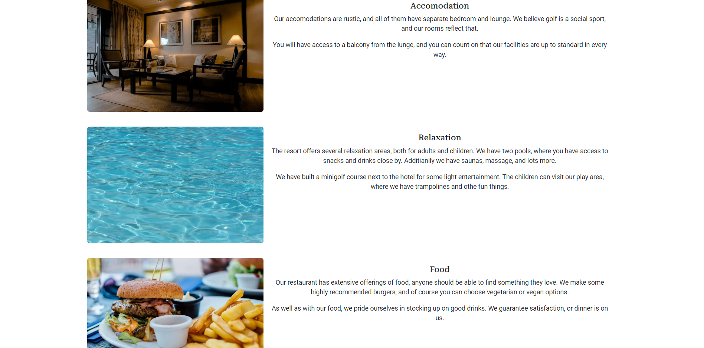

# Golfers Dream

## Introduction

[Golfers Dream](https://golfers-dream-2d6e1b933be7.herokuapp.com/) is a website for a Golf Resort.

They offer hotel, restaurant, relaxation and most importantly Golf!

The idea is that people want to come here and thoroughly relax, with their favorite hobby attached.

You make one booking, and most things are included.

## Table of Contents

- [Golfers Dream](#golfers-dream)
  - [Introduction](#introduction)
  - [Table of Contents](#table-of-contents)
  - [User Personas](#user-personas)
  - [User Stories](#user-stories)
  - [User Goals](#user-goals)
  - [Website Owner Goals](#website-owner-goals)
  - [Design](#design)
    - [Wireframes](#wireframes)
    - [Fonts](#fonts)
    - [Colors](#colors)
  - [Screenshots of Finished Website](#screenshots-of-finished-website)
  - [Features](#features)
  - [Features to Add](#features-to-add)
  - [Deployment](#deployment)
  - [Languages and Frameworks](#languages-and-frameworks)
  - [Testing](#testing)
    - [Validation](#validation)
    - [Lighthouse Report](#lighthouse-report)
    - [Responsiveness](#responsiveness)
    - [Automated Testing](#automated-testing)
    - [Manual Testing](#manual-testing)
      - [Navbar](#navbar)
      - [Footer](#footer)
      - [Home Page](#home-page)
      - [What We Offer](#what-we-offer)
      - [Contact](#contact)
      - [Booking](#booking)
      - [Profile](#profile)
      - [Edit Booking](#edit-booking)
      - [Delete Booking](#delete-booking)
      - [Sign Out](#sign-out)
      - [Sign In](#sign-in)
      - [Sign Up](#sign-up)
      - [Admin](#admin)

## User Personas

- A person whos favorite hobby is golf, wants an all inclusive golf vacation.
- A group of friends that play golf together, wants to get away on an all inclusive trip.
- A family wants bonding time over their hobby, with extra pampering on the side.

## User Stories

The user stories outlined in my [GitHub Project](https://github.com/users/hogbergmarkus/projects/14/views/1) is what drove my development of features.

I created epics with a following user story. Then created acceptance critera and tasks for each user story.

To implement agile methodology I utilized GitHub Projects, along with priority labels, and mapped them to a Milestone.

The user storys in my GitHub project are as follows:

- As a user I can easily navigate from the home page since it is not cluttered so that I can get to what I want fast.
- As a Site User I can create an account so that I can sign in.
- As a Site User I can make a booking with the resort so that I have a reservation.
- As a Site User I can go to my profile page so that I can see my bookings.
- As a Site User I can edit and delete my bookings so that I can adjust my bookings if I change my mind.
- As a Site Admin I can view contact requests from the contact form so that I can respond to the request.
- As a Site Admin I can create, read, update and delete user bookings so that I can manage the bookings.
- As a Site User I can view images and read about the resort so that I can decide if it is for me.

## User Goals

New user:

- I am able to find my way accross the website without hassle.
- I can read enough about the resort to understand what it is about.
- Sign up process is easy.
- I can contact the resort without registering for an account.

Returning user:

- Sign in is easy.
- My bookings are viewable, and I can manage them.
- I can contact the resort if I need to.

## Website Owner Goals

The purpose of this site is to attract golfers that want some extra luxury.

The interface is simple but striking. You should be attracted to the beautiful image of the golf course on the home page,

followed by the lyxury shown on the "what we offer" tab. That is if you don't immediately press the "Book Now" button.

The website should work on any device, mobile, tablet or desktop.

## Design

### Wireframes

You will find the link to my wireframes here: [WireFrames](https://github.com/hogbergmarkus/golfers-dream/tree/main/documentation/wireframes).

Alternatively go to my [GitHub repository](https://github.com/hogbergmarkus/golfers-dream) and look in the documentation folder.

### Fonts

I applied Roboto-Serif to the entire body, but overrid it for paragraphs with Roboto for better readability.

Roboto-Serif has that luxury feel that I was trying to achieve with the website,

while Roboto is less stylish, but easier to read.

### Colors

I used color extremely sparingly, only a slight shade to the navbar and footer.

I wanted the images to pop, and no distraction on the form pages except for the buttons.

## Screenshots of Finished Website

This is the landing page, beautiful in its simplicity.

On the tab "What we offer" potential custumers are further drawn in.

The contact page offers a contact form for everyone, signed in or not.

The booking page requires users to be signed in.

If signed in, the booking page instead shows you a booking form.

Your Profile page is accessible after sign in. This is how it look without any bookings.

With some bookings it looks like this.

## Features

- Navigation bar is active, and will display the current page you are on.

  This makes navigation easier.

- Navigation bar is responsive, which is useful for anyone visiting the site on a smaller screen.

- In the footer is an address, links to social media, links for the page itself and a copyright text.
  
  Serving an address is good manners, so people can figure out how to get there.

  Links to social media seems like a good idea considering how many people use it.

  I though some duplicate links in the footer would be useful, especially if the website expands with more content.
  
  So when you are at the bottom of the page you can click a new link straight away,

  instead of having to scroll all the way to the top.

- A beautiful image to draw people in, with a call to action in the center.
  
  The info box with call to action in the middle should give you an immediate idea of what the resort offers,

  and a button to act if you are already convinced.

- On the "what we offer" page you can read about the resorts offerings.
  
  Especially for a new user, this is the place to get a feel for what the resort is like.

- The contact page offers a form, to send a message to the resort.
  
  This can be of use both to new and existing users, since you can ask anything in this form.

- The booking page will display a message when not signed in, asking you to sign in or sign up.
  
  Additionally there are two cleatly marked buttons able to take you there.

  This is useful to not have to go looking for the right place.

- When signed in you will see the booking form, allowing you to make a reservation.
  
  This part is vital to the site, since we want people to book a stay.

- The sign up form captures all the information needed for the user.
  
  This is useful to be able to let them make a booking.

- The sign in form lets a registered user sign in to the website.
  
  They will then be able to make a booking and see their already crated bookings.

- On the profile page you can see your bookings, along with choices to edit or delete them.
  
  This is good for users to be able to make changes to their reservations.

- When you choose to edit your booking, the form is pre filled with all the information from your previous booking.
  
  This is good for ease of use, you can see right away how your booking looked when you made it.

- There are several safeguards on the booking form that should help prevent user error.
  
  The form will display what went wrong. This should help correct misstakes.

- When choosing to delete a booking, there is a confirmation page showing.
  
  This is useful to not be able to accidentaly delete a booking.

- I've tried putting cancel buttons where necessary, this should help navigation on the site.
  
  Instead of having to rely on browser built in navigation, for example when editing a booking.

  You can simply press the cancel button to take you back.

- I've put success messages on successful user actions.
  
  This is useful feedback that their actions were successfull.

- There are also error messages showing if something went wrong.
  
  This is good to let users know their action was unsuccessful.

- When signed in there is a persistant message just below the navigation bar, letting you know you are signed in.
  
  This is useful, and makes the site feel more personal.

## Features to Add

In the future there are a lot that could be added to this website, I will list a few below:

- Clickable items under the "What we offer" tab, to expand to show more information about each thing.
- More customizable usertypes, such as guest, receptionist, manager and so on.
  
  These can also then be set up with each its own restrictions and capabilities.
- The profile page could show editable information about the users account, and maybe golf handicap.
- A shop could be added to the page.

## Deployment

The project was deployed to Heroku as the steps below details.

- I set up a postgreSQL server at [elephantsql](https://customer.elephantsql.com/).
- Made sure to adjust the settings file accordingly, to utilize that database.
- Made sure to have my SECRET_KEY and DATABASE_URL in the env.py file.
- And the env.py file added to .gitignore.
- I installed gunicorn version 20.1.
- Add gunicorn to requirements.txt.
- Install whitenoise version 5.3.
- Add whitenoise to requirements.txt.
- Add whitenoise to middleware settings file.
- Also in the settings file create a path for whitenoise to collect static files.
- Create a Procfile, and declare it is a web process followed by the command to execute the project.
- Add a runtime.txt file to root directory, and add a supported python version as close as possible to my own.
- Run the command collectstatic, to collect static files.
- Set Debug to False in the settings file.
- Add Heroku to allowed hosts in the settings file (.herokuapp).
- Push the code to GitHub.
- Create a new app on [Heroku](https://id.heroku.com/login).
- On the settings tab of my app I clicked "Reveal Config Vars" and add DATABASE_URL and SECRET_KEY.
- DATABASE_URL got the value of my postgresql database url.
- SECRET_KEY got a very long and complicated value that I'm not going to tell you about!
- Then I went back to the deploy tab of my app, and clicked connect to GitHub.
- I then searched for my repository and connected it to the app.
- Click Deploy branch.

Here is a link to my Deployed project: [Golfers Dream](https://golfers-dream-2d6e1b933be7.herokuapp.com/)

Cloning or forking this project can be done from my [GitHub repository](https://github.com/hogbergmarkus/golfers-dream)

You will need to install the dependencies using the pip install -r requirements.txt command.

The database I used for this project is postgreSQL, specifically [elephantsql](https://customer.elephantsql.com/login).

## Languages and Frameworks

Both Django 4.2.1 and Bootstrap 5.3 were used to create this project.

Added libraries can be seen in the requirements.txt file.

Additionally, custom- python, html, django templating language, and css were all used.

The README was written using markdown.

## Testing

### Validation

Python was validated using [PEP8 CI python linter](https://pep8ci.herokuapp.com/), with no errors or warnings.

CSS was validated using [jigsaw](https://jigsaw.w3.org/css-validator/#validate_by_input), with no errors or warnings.

HTML was validated using [W3C Validator](https://validator.w3.org/#validate_by_uri), with no errors or warnings.

### Lighthouse Report

The following are lighthouse reports from my different pages:

- Home:

- What we offer:

- Contact:

- Booking, not signed in:

- Booking signed in:

- Edit booking:

- Delete booking:

- Profile:

- Sign up:

- Sign in:

- Sign out:

### Responsiveness

The website was tested throughout development to be functional for mobiles, tablets, laptops and desktops.

The main devices used for testing during development have been:

- My desktop
- Samsung galaxy fold
- Iphone 12 pro
- Ipad Pro

After deploying to Heroku, I've also tested further on:

- Google pixel 8 pro
- iphone 13 pro

The browsers tested have been:

- Google Chrome
- Microsoft Edge
- Safari

### Automated Testing

I realize that I could have written more tests, and this is something I aim to improve upon in the future.

However the tests that I have written, are for the contact form, and the booking form.

Ideally, I should have written tests for every view and form, but with limited experience and time,

this is what I managed to get done at this point.

### Manual Testing

Each title under "Works" was tested manually and marked with an X for yes if it works, and no if it does not.

The Final tests marked here was conducted on the deployed version on Heroku.

#### Navbar

|Works                                                       |YES |NO |
|------------------------------------------------------------|:---:|---|
|"Golfers Dream" lead to Home page                           |X  |   |
|Current page is active                                      |X  |   |
|Navbar collapses to hamburger on smaller screen             |X  |   |
|Hamburger icon expands when clicked and links still work    |X  |   |
|Conditional statement hides profile page when not signed in |X  |   |
|Contact link in footer leads to correct page                |X  |   |

#### Footer

|Works                                              |YES |NO |
|---------------------------------------------------|:---:|---|
|Facebook leads to correct site and opens new tab   |X  |   |
|Instagram leads to correct site and opens new tab  |X  |   |
|Twitter leads to correct site and opens new tab    |X  |   |
|Home link in footer leads to correct page          |X  |   |
|What we offer link in footer leads to correct page |X  |   |
|Contact link in footer leads to correct page       |X  |   |

#### Home Page

|Works                                   |YES |NO |
|----------------------------------------|:---:|---|
|Page loads                              |X  |   |
|Book now button leads to booking page   |X  |   |
|Still leads there when signed in        |X  |   |
|Content is responsive                   |X  |   |

#### What We Offer

|Works                    |YES |NO |
|-------------------------|:---:|---|
|Page loads               |X  |   |
|Content is responsive    |X  |   |

#### Contact

|Works                                        |YES |NO |
|---------------------------------------------|:---:|---|
|Page loads                                   |X  |   |
|Form can send a message to admin page        |X  |   |
|On submission, user redirect to home page    |X  |   |
|All fields are required                      |X  |   |
|Email field requires an email address        |X  |   |
|Content is responsive                        |X  |   |

#### Booking

|Works                                                       |YES |NO |
|------------------------------------------------------------|:---:|---|
|Page loads                                                  |X  |   |
|If not signed in, user is asked to sign in/up               |X  |   |
|Sign up button leads to correct page                        |X  |   |
|Sign in button leads to correct page                        |X  |   |
|After sign in, booking form loads on page                   |X  |   |
|All fields except message is required                       |X  |   |
|If filled out correctly, form posts to database             |X  |   |
|Status is set to pending by default                         |X  |   |
|Success message displays on successful submission           |X  |   |
|Email must be an email address                              |X  |   |
|Number of people must be set between 1 and 10               |X  |   |
|Check in cannot be set after check out, or in the past      |X  |   |
|Check out cannot be set before check in, or in the past     |X  |   |
|Error messages let you know something was wrong             |X  |   |
|Content is responsive                                       |X  |   |

#### Profile

|Works                                                       |YES |NO |
|------------------------------------------------------------|:---:|---|
|Page loads                                                  |X  |   |
|Not accessible if not signed in                             |X  |   |
|User bookings show on page                                  |X  |   |
|Edit button works, lets user edit correct booking           |X  |   |
|Delete button work, lets user delete correct booking        |X  |   |
|Content is responsive                                       |X  |   |

#### Edit Booking

|Works                                                       |YES |NO |
|------------------------------------------------------------|:---:|---|
|Page loads                                                  |X  |   |
|Not accessible if not signed in                             |X  |   |
|Form works the same as on booking page                      |X  |   |
|Cancel button takes user back to profile page               |X  |   |
|Success massage display on successful edit                  |X  |   |
|The edited version is displayed on profile page             |X  |   |
|Content is responsive                                       |X  |   |

#### Delete Booking

|Works                                                       |YES |NO |
|------------------------------------------------------------|:---:|---|
|Page loads                                                  |X  |   |
|Not accessible if not signed in                             |X  |   |
|Confirmation page asks if user really want to delete        |X  |   |
|Cancel button takes user back to profile page               |X  |   |
|Press delete again and the booking is deleted               |X  |   |
|Content is responsive                                       |X  |   |

#### Sign Out

|Works                                                       |YES |NO |
|------------------------------------------------------------|:---:|---|
|Page loads                                                  |X  |   |
|Not accessible if not signed in                             |X  |   |
|Confirmation page asks if user really want to sign out      |X  |   |
|Sign out signs user out                                     |X  |   |
|Content is responsive                                       |X  |   |

#### Sign In

|Works                                                       |YES |NO |
|------------------------------------------------------------|:---:|---|
|Page loads                                                  |X  |   |
|All fields required                                         |X  |   |
|Sign up button takes user to sign up page                   |X  |   |
|Sign in works                                               |X  |   |
|Content is responsive                                       |X  |   |

#### Sign Up

|Works                                                       |YES |NO |
|------------------------------------------------------------|:---:|---|
|Page loads                                                  |X  |   |
|All fields required                                         |X  |   |
|Email must be an email address                              |X  |   |
|Sign in button takes user to sign in page                   |X  |   |
|Sign up works                                               |X  |   |
|Content is responsive                                       |X  |   |

#### Admin

|Works                                                       |YES |NO |
|------------------------------------------------------------|:---:|---|
|Page loads                                                  |X  |   |
|I can view, create, edit, delete users                      |X  |   |
|I can view, create, edit, delete bookings                   |X  |   |
|I can view contact requests and mark them as read           |X  |   |
